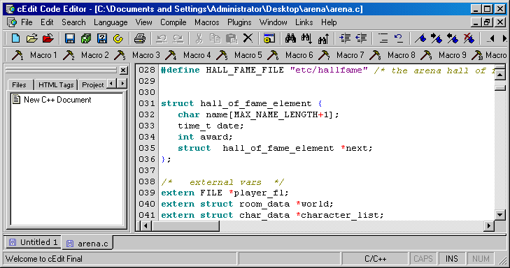

<div align="center">

## cEdit 4\.4


</div>

### Description

cEdit 4.4 includes some more bug fixes that some users found along with a few more updates including a built in webbrowser as request, snippets as requested, and full template support with a simplistic template editor. The snippets you can just drag a file over the snippet window and it will be added as a snippet. This version also has a links menu it's purpose is simply to give access to some links I feel are worth while for coders :)
 
### More Info
 


<span>             |<span>
---                |---
**Submitted On**   |
**By**             |[Stewart](https://github.com/Planet-Source-Code/PSCIndex/blob/master/ByAuthor/stewart.md)
**Level**          |Intermediate
**User Rating**    |4.8 (91 globes from 19 users)
**Compatibility**  |VB 6\.0
**Category**       |[Complete Applications](https://github.com/Planet-Source-Code/PSCIndex/blob/master/ByCategory/complete-applications__1-27.md)
**World**          |[Visual Basic](https://github.com/Planet-Source-Code/PSCIndex/blob/master/ByWorld/visual-basic.md)
**Archive File**   |[](https://github.com/Planet-Source-Code/stewart-cedit-4-4__1-29988/archive/master.zip)


### Source Code

```
I couldn't upload again you can get it here:
http://prdownloads.sourceforge.net/cedit/cEdit.zip
```

